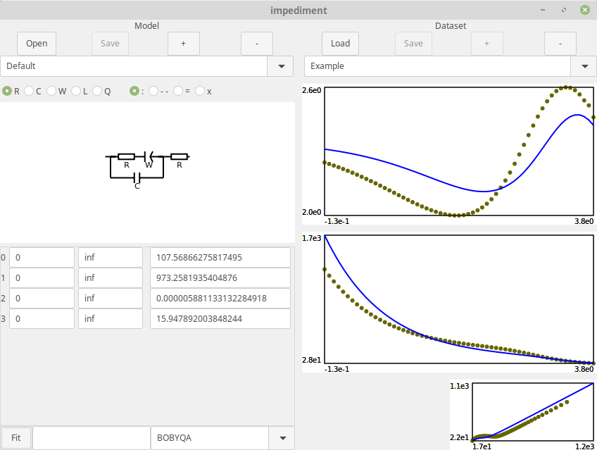

# impediment

[WIP] An interactive tool for impedance spectra modelling and fitting

Currently supports:

* An interactive equivalent circuit builder
* CSV file import
* Model parameter fitting using [nlopt](https://crates.io/crates/nlopt)
* Manual parameter fitting

# Usage

See [interface guide](doc/manual/Usage.md).

# Screenshots

# Building

The software is written in [Rust](http://github.com/rust-lang/rust/), it requires [rust toolchain](https://rustup.rs/) to be built.

The software uses `gtk-rs` crate. It expects GTK+, GLib and Cairo development packages. See gtk-rs [requirements page](http://gtk-rs.org/docs/requirements.html).

Simply `cargo build --release` to build the application.
