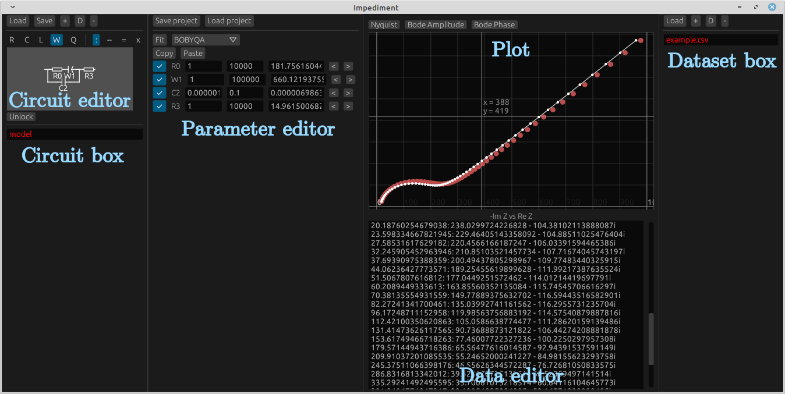
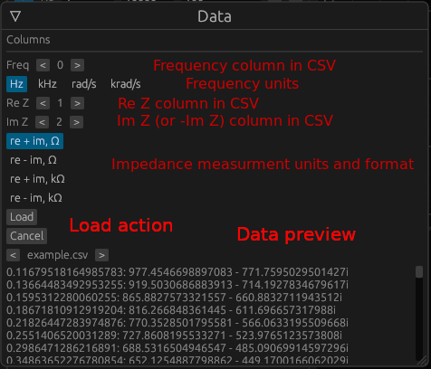

# General

The impediment's project consists of a list of _Circuits_ and a list of
_Datasets_. Circuit is represented by a number of passive elements connected
in series and/or parallel. Dataset is a number of points "frequency-impedance" to
be (normally) fitted to. The circuit provides a few parameters to be adjusted
according to the electrical components. Each pair of circuit-dataset has its
own set of parameters.

|           |    Circuit 1    |   Circuit 2     |
|----------:|:---------------:|:---------------:|
| Dataset 1 | Parameter set 1 | Parameter set 2 |
| Dataset 2 | Parameter set 3 | Parameter set 4 |
| Dataset 3 | Parameter set 5 | Parameter set 6 |

# GUI

## Circuit and dataset box

The circuit box and dataset box display all the loaded circuit models and datasets.

- Click a textbox in circuit editor to select a circuit. It highlights with red.
- Click a textbox in dataset editor to select a dataset. It also highlights with red.
- The circuits and datasets may be renamed in-place.

## Plot graph

The graph displays the selected dataset (red circles) and the simulated
impedance spectrum from the selected circuit (white line and circles).
Nyquist and Bode diagrams may be selected for plotting.

- Drag or scroll to navigate.
- Ctrl-scroll to zoom.
- Double click to reset the axes bounds.

## Circuit editor

The top part is related to circuit management:

- Click "Load" button to load a circuit from file (internal format).
- Click "Save" button to save a circuit to file (same internal format). 
  Only a single circuit with no parameter values is saved.
- Click "+" button to add a new circuit (a single resistor to start with).
- Click "D" button to duplicate the current circuit, including all its parameters.
- Click "-" button to delete the current circuit.

The bottom part is related to circuit editing. The editable circuit are painted with
pink. Any change of a circuit's parameter locks the circuit from editing. The locked
circuit is painted with white.

- Click the _action_ button to choose either replace element [:], remove element
 [x], or add the element in series[--]/parallel[=].
- Choose the appropriate _element_, if needed: [R] Resistor, [C] Capacitor,
[W] Warburg element, [L] Inductor, [Q] Constant phase.
- Click the element on circuit graph.

## Dataset box

The dataset box is a dataset management toolkit.

- Click "Load" button to load a circuit from CSV file, see [CSV loading](#csv-loading).
- Click "+" button to add a new empty dataset.
- Click "D" button to duplicate the current dataset, including all the parameters
  between circuits and the dataset.
- Click "-" button to delete the current dataset.

## Dataset editor

The dataset may be edited in a _dataset editor_. The values are stored
in the format of {Frequency, Hz}: {Re Z} + {Im Z}i, such as:

`100000: 30 - 25i` - means a point with the frequency of 100 kHz having the
impedance of (30 - 25i) ohms.

The dataset is updated on the click outside the data editor.

## Parameter editor

The parameters are listed in _parameter editor_.

All the parameters contain min and max bounds (used by fitting routines) and
the parameter value itself.

When the parameter values are edited, the plots are immediately updated. One
can use "<" and ">" buttons to increase or decrease the parameter value
logatithmically. Shift-click for slower, Ctrl-click for faster edit.

Click "Fit" button to perform a fitting routine with the selected method.

The complete parameter set may be copied and pasted ("Copy"/"Paste" buttons) for
the same circuit.

# CSV loading

The CSV loading procedure allows to load multiple files with the same data layout
at once. After the files are selected, customize the CSV column numbers for
frequency, real and imaginary impedance values. The data preview is available.

